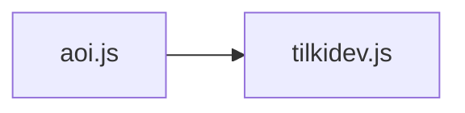

<p align="center">
  <a href="https://docs.tilki.dev">
    
  </a>
</p>
<p align="center"><a href="https://aoi.js.org">TilkiDev.js gücünü aoi.js'den alıyor!</a></p>

---

<div align = "center">

**[ Doküman (Yakında) ](https://docs.tilki.dev)** | **[ Destek Sunucusu ](https://tilki.dev/discord)** | **[ Website ](https://tilki.dev/)** | **[ NPM ](https://npmjs.org/package/tilkidev.js)** | **[ GitHub ](https://github.com/akaruidevelopment/tilkidev.js)**

</div>

---

## Bilgi

Bu modül aoi.js'de zorlananlara yaptım inşallah beyenirsiniz <3

## İndirme

```bash
### npm
npm i tilkidev.js
```

### Main

```javascript
const {AoiClient} = require("aoi.js");

const bot = new AoiClient({
token: "token",
prefix: "t!",
intents: ["MessageContent", "Guilds", "GuildMessages"],
  events: [
      "onMessage",
      "onInteractionCreate"
    ]
})


const { Tilki } = require("tilkidev.js");
const tilki = new Tilki({ bot:bot });
tilki.TilkiDev();


bot.command({
  name: "tilki-sürüm",
  code: `$tilkiv`
})
```

## Kısaca :D



## Lisans
TilkiDev.js'nin lisans'ı var B) [MIT Lıstence](./LICENSE).

